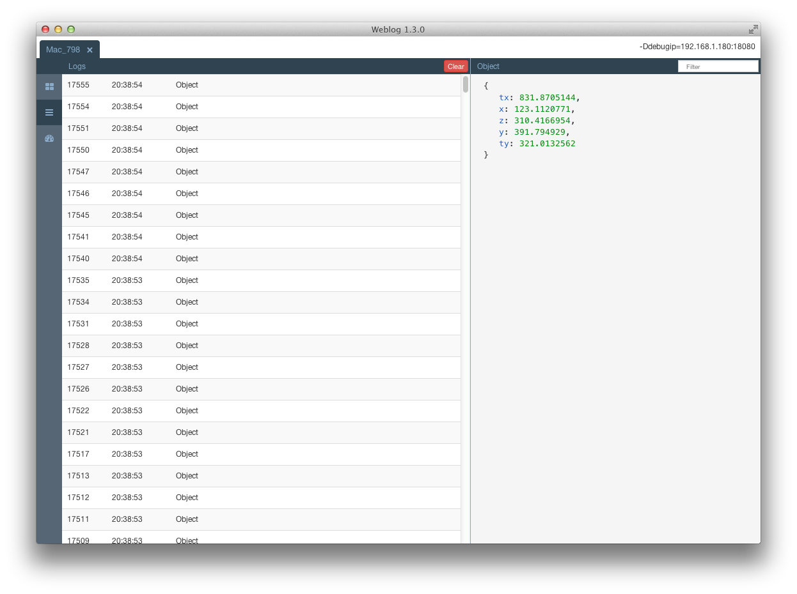
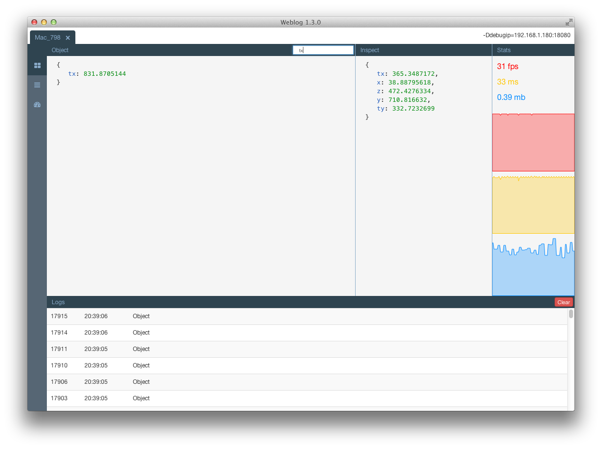
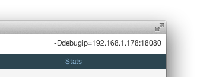

<p align="center"></p>

Weblog
============

Haxe remote debugging tool.
This project require node-webkit.
```sh
haxelib install node-webkit
```


Features
=========
- Logs
- Object debugging
- Object inspect
- Realtime stats
- Multiple devices at the same time
- Profiler
<p align="center"></p>
<p align="center"></p>
<p align="center"></p>


Installation
=========
```sh
haxelib install weblog
```

For development version use:
```sh
haxelib git weblog https://github.com/zasmarkany/weblog.git
```


Launch
=========
```sh
haxelib run weblog
```


Usage
=========
```haxe
package ;

import flash.display.Sprite;
import flash.events.Event;
import Weblog;

class Main extends Sprite{

    var p:Dynamic;

    public function new () {

        super ();
        Weblog.tic("new");
		
		p = {
			x: 0,
			y: 0,
			z: 0,
			tx: 0,
			ty: 0,
		};
		
        Weblog.log("Hello :)");

		
        Weblog.statsStart();

        Weblog.debug(new Sprite());
        Weblog.debug(
			{
				a: {
					b: 1, 
					c: 2
					}, 
				d: "aaaa",
				e: {
					f: 1, 
					g: 2
					}, 
				h: "aaaa",
			}
		);

        Weblog.inspect(p);

        stage.addEventListener(Event.ENTER_FRAME, onEnterFrame);


        Weblog.toc("new");
    }

    function onEnterFrame(e:Event):Void{
		if(Math.random()*1000<10){

	        Weblog.tic("debug");
			Weblog.debug(p);
	        Weblog.toc("debug");

		}
        p.x = Math.random()*1000;
        p.y = Math.random()*1000;
        p.z = Math.random()*1000;
        p.tx = Math.random()*1000;
        p.ty = Math.random()*1000;
    }

}
```

To use synchronyus communication (usefun for neko targets):
```
Weblog.synchronous = true;
```


Project Compilation
=========
To use this library application need ip and port. 
Lime/haxe project have to copiled with additional flag:
```sh
lime test [platform] -Ddebugip=[WEBLOG_IP]:18080
```

To set fixed tab name use:
```
-Dweblogid=APP_NAME
```

WEBLOG_IP - is IP adress of machine where Weblog is running. Adress can be found at top right corner.
<p align="center"></p>
As a consequence, if you are developing and running the Weblog inpsector app on the same localhost machine, you can just compile your project with `-D debugip=localhost:18080` flag.
